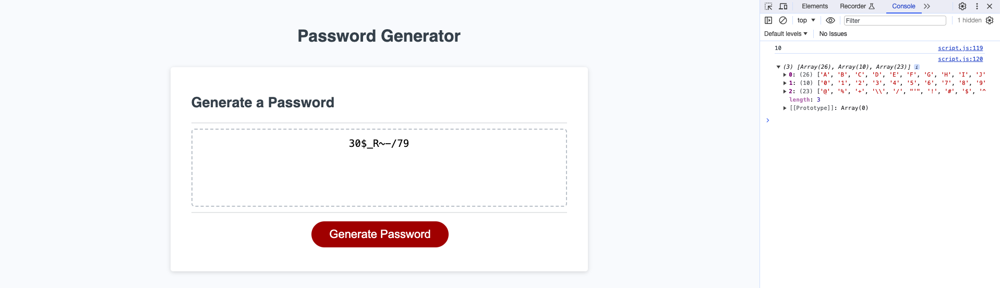

# password-generator

## Description 
This password-generator project was created to develop an application tool designed for employees to generate a randomly generated password based on their chosen criteria.

The URL of the deployed application: https://itismliu.github.io/password-generator/

The URL of the GitHub repository: https://github.com/ItIsMLiu/password-generator

Screenshot of webpage and console:

A starter code pack (as shown in the second commit) was provided, including the completed HTML and CSS files, and a JavaScript file with pre-written arrays of characters and other codes enabling the click-to-generate password action. Subsequently, the project was developed incorporating my newly acquired JavaScript knowledge. Below, I've highlighted the integration of these skills within the project:

- Use of a while loop.
- Functions: Prompt, confirm & alert; Floor and Random.
- Methods: push & join.
- Use of functions to complete the three major steps to achieve the pseudocode.

Pseudocode for this project is as follows:

1. Prompt the user to choose the desired password length and store the input in a global variable.
2. If the input is between 8 and 128 characters, confirm other password options. Otherwise, alert an error and prompt the user again to input the correct length.
3. Ask the user to confirm the four password options:
- Create a global variable characterType = [].
- Confirm whether to include lowercase - if true, push the lowercase array to characterType.
- Confirm for uppercase - if true, push the array to characterType.
- Confirm for numeric - if true, push the array to characterType.
- Confirm for special characters - if true, push the array to characterType.
4. If the user didn't include at least one character type, then re-confirm the four options.
5. Create a variable password as an empty array.
6. Use the global variables passwordLength and characterType as parameters. Use a loop to get random selections of character type arrays from the character types that the users included. Then, get a random selection of a character from that array and push it to the password array. Repeat until the password array length matches the desired password length that the user initially entered.
7. Finally, return a password array.

## Installation

N/A

## Usage 

Open the webpage by clicking on the provided URL link. Click on the red button labeled 'Generate Password.' A window will prompt you to enter a number from 8 to 128, indicating your desired password length. Once you've entered the desired length, the system will ask you to confirm whether to include the four different character types. At least one character type must be included. If you enter a password length that is not in the provided range or don't any character type, the browser will prompt you again until the specified criteria are met. Finally, you will see a randomly generated password based on your selected character type(s) in the dashed box. To generate a new random password, simply refresh the page and repeat the above steps.

## Credits

Other resources used as guides:
- push() method: https://developer.mozilla.org/en-US/docs/Web/JavaScript/Reference/Global_Objects/Array/push
- join() method: https://developer.mozilla.org/en-US/docs/Web/JavaScript/Reference/Global_Objects/Array/join
- Math.random(): https://developer.mozilla.org/en-US/docs/Web/JavaScript/Reference/Global_Objects/Math/random

## License

MIT license (Please refer to the LICENSE in the repository).
